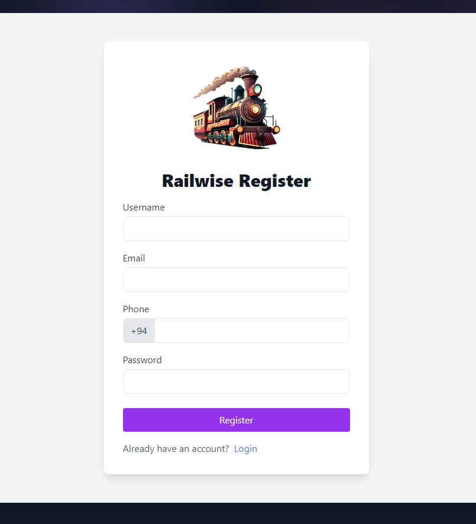
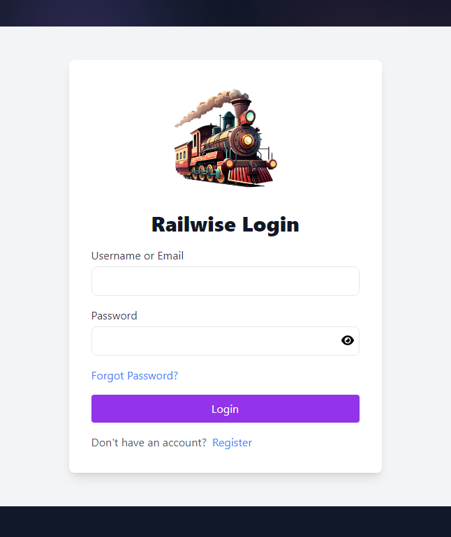

# How to Use Railwise

::: info
Documentation is essential for smooth user experiences, especially when managing train bookings. Whether you're a registered or unregistered user, this guide will show you how to use Railwise for booking tickets, managing reservations, and more.
:::

## Getting Started

[Railwise](https://railwise-web.onrender.com) is a modern train booking system designed to simplify your travel planning. This guide will help you navigate the platform, providing insights into key features like searching schedules, selecting seats, and confirming bookings.

## Register an account to track your bookings.
- **Register an Account** 

    

- **User Login** 

    

## Booking Tickets

To book a ticket, follow these steps:

1. **Search for a Train**: Input your departure and arrival stations, travel date, and preferred time.

    

2. **Select Your Schedule**: Choose from available trains.

    

::: info
There is a Pop-Up message to register an account to track your bookings and get notifications.
:::

3. **Select Your Class**: Choose from available trains, select your preferred class (e.g., first-class, second-class).

    

4. **Choose Seats**: Pick your preferred seats from the seat map.

    
5. **Enter Email**: Provide your email address for booking confirmation and updates.

    

## Payment and Confirmation

After selecting seats:

1. **Proceed to Payment**: Enter your payment details. Railwise supports multiple payment methods including credit cards and mobile payments.

    

2. **Booking Confirmation**: Once payment is successful, you will receive an email confirmation with your ticket and booking details.

    

## Managing Bookings

As a <b>registered</b> user, you can:

1. **View Booking History**: Access your past and upcoming bookings under the "My Bookings" section.
2. **Cancel a Booking**: If your plans change, cancel your booking easily from your account.

